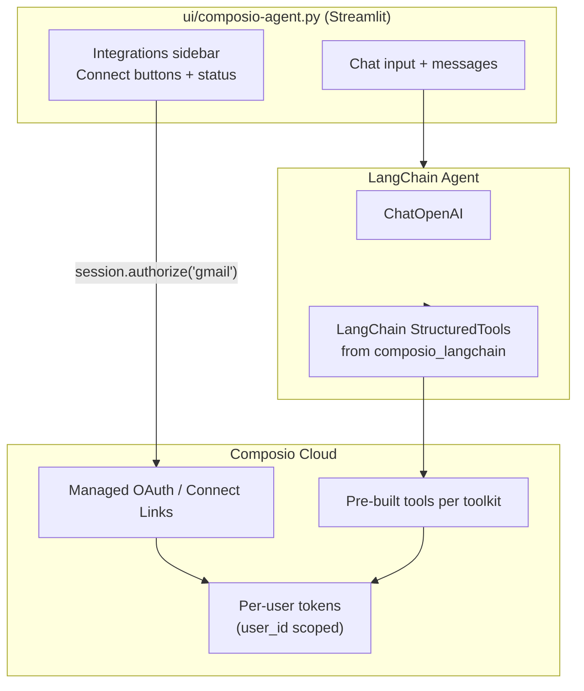

# Composio Agent Integration Plan

This document describes how to add a **standalone Composio-powered chat agent** to `ai_flow`, separate from the existing RAG agent in `ui/app.py`.

---

## 1. Goal

Build `ui/composio-agent.py` — a simple Streamlit chatbot where:

1. The user sees integrations they can connect (Jira, Linear, Gmail, Google Calendar, Notion, GitHub, Typeform, Apollo, Todoist).
2. The user clicks **Connect**, completes OAuth via Composio, and returns.
3. The user chats naturally: *"Summarize my emails from today"*, *"What Linear issues are assigned to me?"*, *"Summarize my Notion pages about project X"*.
4. The agent uses Composio tools to **fetch → read → summarize** from whichever connected apps are relevant.

This is intentionally **simpler** than `ui/app.py` (no Pinecone, Neo4j, ingestion, guardrails, or LangGraph router). It is a focused “connected apps assistant.”

---

## 2. Current Project State (what we checked)

| Item | Status |
|------|--------|
| Main UI | `ui/app.py` — Streamlit RAG agent with LangGraph |
| External tools today | **Arcade MCP** via `src/tools/mcp.py` (Gmail, Notion, Google Docs, Outlook) |
| Composio in codebase | **Not present** — no imports, no env vars |
| Composio in `pyproject.toml` | **Not listed** |
| `poetry show composio` | **Package not found** (needs `poetry add`) |
| Existing OAuth UI pattern | `ui/app.py` already handles auth interrupts with link button + “I've Authorized” — reusable pattern |

**Important:** You mentioned installing Composio with Poetry, but it is not recorded in `pyproject.toml` / `poetry.lock` yet. Run the install step in §4 before coding.

---

## 3. What Composio Gives You (v3 model)

Composio replaces the “build OAuth + wrap every API yourself” work with:

| Feature | What it means for you |
|---------|----------------------|
| **`composio_langchain`** | Converts Composio tools → LangChain `StructuredTool` automatically |
| **`user_id`** (was “entity_id”) | Per-user credential isolation — agent always runs as the right user |
| **Managed OAuth** | Composio hosts consent screens; you redirect to a Connect Link |
| **Pre-built tools** | e.g. `GMAIL_FETCH_EMAILS`, `GOOGLECALENDAR_FIND_EVENT`, `NOTION_FETCH_DATA`, `GITHUB_LIST_ISSUES` |
| **Meta tools** | `COMPOSIO_SEARCH_TOOLS`, `COMPOSIO_MANAGE_CONNECTIONS` — agent discovers tools and handles auth in chat |
| **Sessions** | `composio.create(user_id=...)` is the single entry point |

Official docs: [LangChain provider](https://docs.composio.dev/docs/providers/langchain) · [Configuring sessions](https://docs.composio.dev/docs/configuring-sessions) · [In-chat auth](https://docs.composio.dev/docs/authenticating-users/in-chat-authentication)

### Terminology (old → new)

| You might say | Composio v3 code |
|---------------|------------------|
| entity_id | `user_id` |
| actions | tools (e.g. `GMAIL_FETCH_EMAILS`) |
| apps | toolkits (e.g. `gmail`, `github`) |
| integration | auth config (`auth_config_id`) |
| connection | connected account |

---

## 4. Prerequisites

### 4.1 API keys (`.env`)

Add to your root `.env`:

```dotenv
# Required
COMPOSIO_API_KEY=your_key_from_composio_dashboard
OPENAI_API_KEY=your_openai_key

# Optional — only if you use custom OAuth apps (white-label)
# COMPOSIO_ENCRYPTION_KEY=...   # if Composio dashboard gave you one for custom auth
```

Get `COMPOSIO_API_KEY` from [Composio Settings](https://platform.composio.dev/settings).

> If by “enc key” you mean Composio’s encryption key for **custom OAuth credentials**, you only need it when storing your own client secrets in Composio — not for default managed OAuth.

### 4.2 Install dependencies

```powershell
cd R:\python\ai_flow
poetry add composio composio_langchain
# langchain + langchain_openai are already in pyproject.toml
```

Verify:

```powershell
poetry show composio composio_langchain
poetry run python -c "from composio import Composio; from composio_langchain import LangchainProvider; print('OK')"
```

### 4.3 Composio dashboard (optional for v1)

For **managed OAuth**, you do **not** need to manually create auth configs — Composio creates them on first connect.

Optional later: create custom auth configs at [platform.composio.dev](https://platform.composio.dev) if you want your own OAuth app branding.

---

## 5. Target Toolkits

These are the Composio toolkit slugs for your requested integrations:

| App | Toolkit slug | Example read/fetch tools |
|-----|--------------|--------------------------|
| Jira | `jira` | `JIRA_GET_ISSUE`, `JIRA_SEARCH_ISSUES` |
| Linear | `linear` | `LINEAR_LIST_LINEAR_ISSUES`, `LINEAR_GET_LINEAR_ISSUE` |
| Gmail | `gmail` | `GMAIL_FETCH_EMAILS`, `GMAIL_FETCH_MESSAGE_BY_MESSAGE_ID` |
| Google Calendar | `googlecalendar` | `GOOGLECALENDAR_FIND_EVENT`, `GOOGLECALENDAR_EVENTS_LIST` |
| Notion | `notion` | `NOTION_FETCH_DATA`, `NOTION_SEARCH_NOTION_PAGE` |
| GitHub | `github` | `GITHUB_LIST_ISSUES`, `GITHUB_GET_A_REPOSITORY` |
| Typeform | `typeform` | `TYPEFORM_GET_FORM`, `TYPEFORM_LIST_RESPONSES` |
| Apollo | `apollo` | `APOLLO_SEARCH_CONTACTS`, `APOLLO_GET_CONTACT` |
| Todoist | `todoist` | `TODOIST_GET_ALL_TASKS`, `TODOIST_GET_TASK` |

Exact tool names can be browsed in the Composio dashboard or via `COMPOSIO_SEARCH_TOOLS` at runtime.

---

## 6. Architecture



### Design choices

| Decision | Recommendation | Why |
|----------|----------------|-----|
| Separate file from `app.py` | `ui/composio-agent.py` | Keeps RAG + Composio concerns isolated |
| Agent framework | LangChain `create_agent` + tool loop | Matches Composio LangChain provider docs |
| Auth UX | **Sidebar pre-connect** + optional in-chat auth | Sidebar gives clear “Integrations” UI; meta tools handle missing connections during chat |
| Session scope | Restrict to 9 toolkits | Smaller tool search space, faster agent |
| `user_id` | Stable per browser session (email or UUID) | Maps 1:1 to Composio connected accounts |

---

## 7. File Layout (proposed)

```
ai_flow/
├── composio_plan.md              ← this file
├── ui/
│   ├── app.py                    ← existing RAG agent (unchanged)
│   └── composio-agent.py         ← NEW: Composio chat + integrations UI
├── src/
│   ├── config.py                 ← add composio_api_key field
│   └── agents/
│       └── composio_agent.py     ← NEW: session + agent factory (optional split)
```

Keeping agent logic in `src/agents/composio_agent.py` is optional but keeps `composio-agent.py` thin (mirrors how `rag_agent.py` works).

---

## 8. Core Code Patterns

### 8.1 Initialize Composio + session

```python
from composio import Composio
from composio_langchain import LangchainProvider

composio = Composio(provider=LangchainProvider())

TOOLKITS = [
    "jira", "linear", "gmail", "googlecalendar", "notion",
    "github", "typeform", "apollo", "todoist",
]

def get_session(user_id: str):
    return composio.create(
        user_id=user_id,
        toolkits=TOOLKITS,
        manage_connections={
            "enable": True,
            "callback_url": "http://localhost:8502",  # your Streamlit URL
        },
        workbench={"enable": False},  # not needed for summarize/fetch
    )
```

### 8.2 Build LangChain agent

```python
from langchain.agents import create_agent
from langchain_openai import ChatOpenAI

def build_agent(session):
    tools = session.tools()
    llm = ChatOpenAI(model="gpt-4.1-mini", temperature=0.2)
    return create_agent(tools=tools, model=llm), tools
```

### 8.3 Connect an integration (sidebar)

```python
def connect_toolkit(session, toolkit_slug: str) -> str:
    """Returns OAuth redirect URL for the user."""
    req = session.authorize(toolkit_slug)
    return req.redirect_url
```

In Streamlit:

```python
if st.button(f"Connect {name}"):
    url = connect_toolkit(session, slug)
    st.link_button("Open authorization", url)
```

### 8.4 List connection status (sidebar)

```python
def list_connections(session):
    for tk in session.toolkits().items:
        active = tk.connection.is_active if tk.connection else False
        yield tk.slug, tk.name, active
```

### 8.5 Run chat turn

```python
SYSTEM = """You are a personal assistant connected to the user's apps via Composio.
When asked to summarize:
1. Fetch relevant data using the appropriate tools
2. Read and synthesize into a clear summary
3. Mention which sources you used (Gmail, Linear, etc.)
If a toolkit is not connected, tell the user to connect it in the sidebar."""

result = agent.invoke({
    "messages": [
        ("system", SYSTEM),
        *history,
        ("user", user_message),
    ]
})
answer = result["messages"][-1].content
```

---

## 9. Streamlit UI Spec (`ui/composio-agent.py`)

### Sidebar — Integrations panel

For each of the 9 toolkits:

- Show name + icon
- Status badge: **Connected** / **Not connected**
- **Connect** button → opens Composio Connect Link in new tab
- Optional: **Refresh status** button (re-call `session.toolkits()`)

Also show:

- Current `user_id` (editable field or auto-generated UUID stored in `st.session_state`)
- “New conversation” button

### Main area — Chat

Reuse patterns from `ui/app.py`:

- `st.session_state.messages` for history
- `st.chat_message` for rendering
- `st.chat_input` at bottom
- Background thread for agent invoke (optional, for responsiveness)

**Do not** copy RAG ingestion, Pinecone, Neo4j, or guardrails — keep this app minimal.

### Run command

```powershell
poetry run streamlit run ui/composio-agent.py --server.port 8502
```

Use port `8502` so it can run alongside `ui/app.py` on `8501`.

---

## 10. User Flows

### Flow A — Connect then summarize

1. User opens `composio-agent.py`
2. Clicks **Connect Gmail** → OAuth in browser → returns
3. Types: *"Summarize unread emails from the last 24 hours"*
4. Agent calls `GMAIL_FETCH_EMAILS` → summarizes

### Flow B — Multi-source summarize

1. User connects Gmail + Linear + Notion
2. Types: *"Give me a daily brief: urgent emails, my Linear issues, and Notion tasks"*
3. Agent searches tools → fetches from each → combined summary

### Flow C — In-chat auth (fallback)

If user skips sidebar connect:

1. User asks about GitHub issues
2. Agent hits `COMPOSIO_MANAGE_CONNECTIONS` → returns Connect Link in chat
3. User authorizes → continues conversation

This is built into Composio by default when `manage_connections.enable=True`.

---

## 11. Implementation Phases

### Phase 1 — Minimal CLI proof (30 min)

Create `scripts/test_composio_gmail.py`:

```python
from composio import Composio
from composio_langchain import LangchainProvider
from langchain.agents import create_agent
from langchain_openai import ChatOpenAI

composio = Composio(provider=LangchainProvider())
session = composio.create(user_id="test_user", toolkits=["gmail"])
print(session.authorize("gmail").redirect_url)  # connect first

tools = session.tools()
agent = create_agent(tools=tools, model=ChatOpenAI(model="gpt-4.1-mini"))
result = agent.invoke({"messages": [("user", "Summarize my last 5 emails")]})
print(result["messages"][-1].content)
```

Validates: API key, OAuth, tool execution.

### Phase 2 — Streamlit shell (1–2 hrs)

- `ui/composio-agent.py` with sidebar integrations + empty chat
- Wire `session.authorize()` connect buttons
- Show connection status via `session.toolkits()`

### Phase 3 — Agent chat loop (1–2 hrs)

- `create_agent` + message history
- System prompt tuned for fetch/summarize
- Error handling for missing connections

### Phase 4 — Polish (optional)

- Add `composio_api_key` to `src/config.py`
- Persist `user_id` in session/localStorage pattern
- Preload common read tools for faster responses:

```python
session = composio.create(
    user_id=user_id,
    toolkits=TOOLKITS,
    preload={
        "tools": [
            "GMAIL_FETCH_EMAILS",
            "LINEAR_LIST_LINEAR_ISSUES",
            "NOTION_FETCH_DATA",
            "GITHUB_LIST_ISSUES",
            "TODOIST_GET_ALL_TASKS",
        ]
    },
)
```

- Callback URL pointing back to your deployed app URL

---

## 12. Composio vs Existing Arcade MCP

Your current stack (`src/tools/mcp.py` + `rag_agent.py` mcp node) uses **Arcade** with manual OAuth interrupts in LangGraph.

| | Arcade (current) | Composio (new app) |
|--|------------------|-------------------|
| Tool source | Arcade MCP servers | Composio catalog (900+ apps) |
| OAuth | Custom interrupt + wait | Connect Links + meta tools |
| Agent | LangGraph node in RAG router | Standalone LangChain agent |
| Apps covered | Gmail, Notion, Google Docs, Outlook | Your 9 apps + easy expansion |
| Coupling | Embedded in RAG graph | Separate `composio-agent.py` |

**Recommendation:** Keep Arcade in `app.py` for now. Build Composio as a parallel app. Later, you can migrate `app.py` to Composio or merge both if desired.

---

## 13. Config update (`src/config.py`)

Add one field:

```python
composio_api_key: Optional[str] = Field(
    default=None, validation_alias="COMPOSIO_API_KEY"
)
```

Composio SDK reads `COMPOSIO_API_KEY` from env automatically, but explicit settings keep consistency with the rest of the project.

---

## 14. Security Notes

- Never commit `.env` or expose `COMPOSIO_API_KEY` in the UI
- Use a stable, non-guessable `user_id` in production (authenticated user ID from your auth system)
- For local dev, a UUID in `st.session_state` is fine
- Composio stores OAuth tokens — you never handle refresh tokens yourself

---

## 15. Troubleshooting

| Problem | Fix |
|---------|-----|
| `Package composio not found` | Run `poetry add composio composio_langchain` |
| `COMPOSIO_API_KEY` missing | Add to `.env`, restart Streamlit |
| Tool says not connected | User must complete Connect Link; check sidebar status |
| Too many tools / slow agent | Restrict `toolkits=`, use `preload.tools`, or `SESSION_PRESET_DIRECT_TOOLS` |
| Wrong user’s data | Verify `user_id` is consistent across session + authorize |
| Old docs mention `entity_id` / `ComposioToolSet` | Use v3 API: `composio.create(user_id=...)` + `session.tools()` |

---

## 16. Example Prompts for Testing

After connecting apps, try:

- *"Summarize my Gmail from today"*
- *"List my open Linear issues assigned to me"*
- *"What's on my Google Calendar this week?"*
- *"Summarize recent GitHub issues in repo `<owner>/<repo>`"*
- *"Show my Todoist tasks due this week"*
- *"Summarize Typeform responses for form `<form_id>`"*
- *"Find Apollo contacts at company Acme Inc"*

---

## 17. Next Step

When you are ready to implement, the order is:

1. `poetry add composio composio_langchain`
2. Add `COMPOSIO_API_KEY` to `.env`
3. Run Phase 1 CLI test script
4. Build `ui/composio-agent.py` (Phase 2–3)

Say the word and we can scaffold `ui/composio-agent.py` and `src/agents/composio_agent.py` directly.
